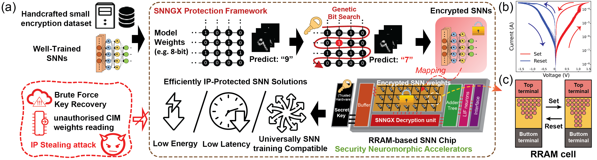

# SNNGX: Securing Spiking Neural Networks with Genetic XOR Encryption on RRAM-based Neuromorphic Accelerator [[PDF]](www.google.com)





## Abstract
Biologically plausible Spiking Neural Networks (SNNs), characterized by spike sparsity, are growing tremendous attention over intellectual edge devices and critical bio-medical applications as compared to artificial neural networks (ANNs). However, there is a considerable risk from malicious attempts to extract white-box information (i.e., weights) from SNNs, as attackers could exploit well-trained SNNs for profit and white-box adversarial concerns. There is a dire need for intellectual property (IP) protective measures. In this paper, we present a novel secure software-hardware co-designed RRAM-based neuromorphic accelerator for protecting the IP of SNNs. Software-wise, we design a tailored genetic algorithm with classic XOR encryption to target the least number of weights that need encryption. From a hardware perspective, we develop a low-energy decryption module, meticulously designed to provide zero decryption latency. Extensive results from various datasets, including NMNIST, DVSGesture, EEGMMIDB, Braille Letter, and SHD, demonstrate that our proposed method effectively secures SNNs by encrypting a minimal fraction of stealthy weights, only 0.00005% to 0.016% weight bits. Additionally, it achieves a substantial reduction in energy consumption, ranging from X59 to X6780, and significantly lowers decryption latency, ranging from $\times175$ to $\times4250$. Moreover, our method requires as little as one sample per class in dataset for encryption and addresses hessian/gradient-based search insensitive problems. This strategy offers a highly efficient and flexible solution for securing SNNs in diverse applications


## Encryption Simulation Result
**This code performs efficient SNNGX genetic weight-bit (MSB) encryption for low overhead on neuromorphic accelerators. The SNNGX method universally applies to differently pretrained SNN models and overcomes gradient insensitivity problems.** 


## Quick Start

*pytorch>=1.10.0+cu111*    
*tonic>=1.4.3*

```
git clone https://github.com/u3556440/SNNGX_qSNN_encryption.git
```


## Usage :rocket:

*The following datasets are not included in this repository. \
Please indicate your path to the Dataset (NMNIST/DVS128_Gesture) in the below bash commands.*


1. SNNGX Encryption (Genetic Algorithm):

```
cd Encryption_SNNGX
```
Example code: 
```
bash __terminal__.sh
```
Full python argument: 
```
python3 __main__.py [--epsil] [--by_layer] [--layer_idx] [--qbit] [--subset] [-b] [--mutate]  [--gen] [--Dataset] [--Dpath] [--seed]
```
Flag | VarType | Help
--- | --- | --- 
`--epsil` | int | Final number of bits to be converged by GA
`--by_layer` | bool | Boolean Flag (True for Layer-wise Encryption / False for All layers Encryption)
`--layer_idx` | int | Layer idx (starting from 0) for Layer-wise Encryption 
`-q`/`--qbit` | int | Quantized bit width of SNN (default: 8bit)
`--subset` | int | Total No. of Samples for encryption dataset
`-b`/`--batch` | int | Batch size for dataset, model, encryption dataset
`--mutate` | float | pixel-wise mutation probability (default: 0.05) 
`--gen` | int | No. of GA_generations
`--Dataset` | str | Available Dataset: "NMNIST"/"DVS128_Gesture"
`--Dpath` | str | Please input your local path to the dataset
`--seed` | int | Random Seed for Repeatable Experimental Result


2. Random bit Encryption:

```
cd Encryption_Random_bit
```
Example code: 
```
bash __terminal__.sh
```
Full python argument: 
```
python3 __main__.py [-nb] [-nt] [--by_layer] [--layer_idx] [--qbit] [-b] [--Dataset] [--Dpath] [--seed]
```

Flag | VarType | Help
--- | --- | --- 
`-nb`/`--numbit` | int | Random BITS flipped %
`-nt`/`--numtrial` | int | No. of trial repetition 
`--by_layer` | bool | Boolean Flag (True for Layer-wise Encryption / False for All layers Encryption)
`--layer_idx` | int | Layer idx (starting from 0) for Layer-wise Encryption 
`-q`/`--qbit` | int | Quantized bit width of SNN (default: 8bit)
`-b`/`--batch` | int | Batch size for dataset and model
`--Dataset` | str | Available Dataset: "NMNIST"/"DVS128_Gesture"
`--Dpath` | str | Please input your local path to the dataset
`--seed` | int | Random Seed for Repeatable Experimental Result


