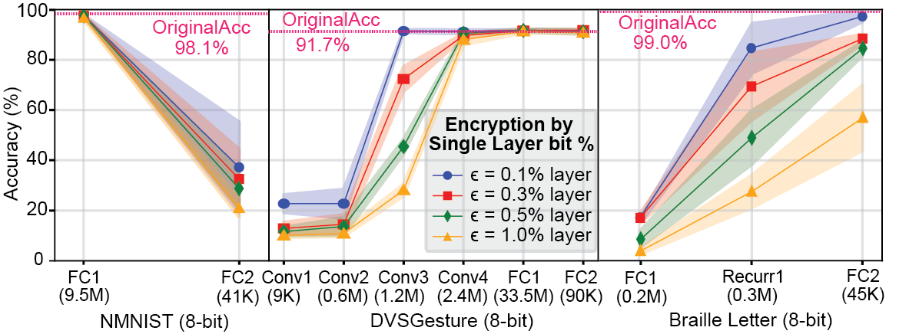

# SNNGX Genetic Alogrithm (Simulation Encryption)


## Software Description

**This code performs efficient SNNGX weight-bit (MSB) encryption and quantization on float32 Spiking neural networks and demonstrates biologically-plausible UNIVERSAL UTILITY on SNN models.** 

**There are SNNGX Encryption implementation, Random bit Encrpytioin baseline and Potential attack threats in this repository and some pretrained weights over NMNIST and DVS128Gesture.**



**This project was supported by AI Chip Center for Emerging Smart Systems (ACCESS) and the University of Hong Kong, EEE. Currently restricted to internal usage only.**

## Quick Start

pytorch>=1.10.0+cu111  
tonic>=1.4.3 

```
git clone https://github.com/u3556440/SNNGX_qSNN_encryption.git
```


## Usage

*Dataset is not included in our repository. \
Please indicate your path to the Dataset (NMNIST/MNIST) in the below bash commands.*


1. SNNGX Encryption (Genetic Algorithm):

```
cd Encryption_SNNGX
```
```
python3 __main__.py [-b] [--epsil] [--name] [--subset] [--mutate] [--gen] [--Dataset] [--Dpath]
```

Flag | VarType | Help
--- | --- | --- 
`--epsil` | int | Final number of bits to be converged by GA
`--by_layer` | bool | Boolean Flag (True for Layer-wise Encryption / False for All layers Encryption)
`--layer_idx` | int | Layer idx (starting from 0) for Layer-wise Encryption 
`-q`/`--qbit` | int | Quantized bit width of SNN (default: 8bit)
`--subset` | int | Total No. of Samples for encryption dataset
`-b`/`--batch` | int | Batch size for dataset, model, encryption dataset
`--mutate` | float | pixel-wise mutation probability (default: 0.05) 
`--gen` | int | No. of GA_generations
`--Dataset` | str | Available Dataset: NMNIST/MNIST
`--Dpath` | str | Please input your local path to the dataset
`--seed` | int | Random Seed for Repeatable Experimental Result

You may wish to modify the follwing # commented code in __main__.py to change the search space 
from all layer to single target layer, and vice versa.


2. Random bit Encryption:

```
cd Encryption_Random_bit
```
```
python3 __main__.py [-b] [-nb] [-nt] [--Dataset] [--Dpath]
```

Flag | Metavar | Help
--- | --- | --- 
`-b`/`--batch` | batch_size | Batch size for dataset and model
`-nb`/`--numbit` | number_of_flipped_BITS | # of Random BITS flipped
`-nt`/`--numtrial` | number_of_random_trials | # of trial repetition
`--Dataset` | Dataset_Target | Available Dataset: "NMNIST"/"DVS128_Gesture"
`--Dpath` | Dataset_Path | Please input your local path to the dataset

You may wish to modify the follwing # commented code in __main__.py to change the search space 
from all layer to single target layer, and vice versa.

